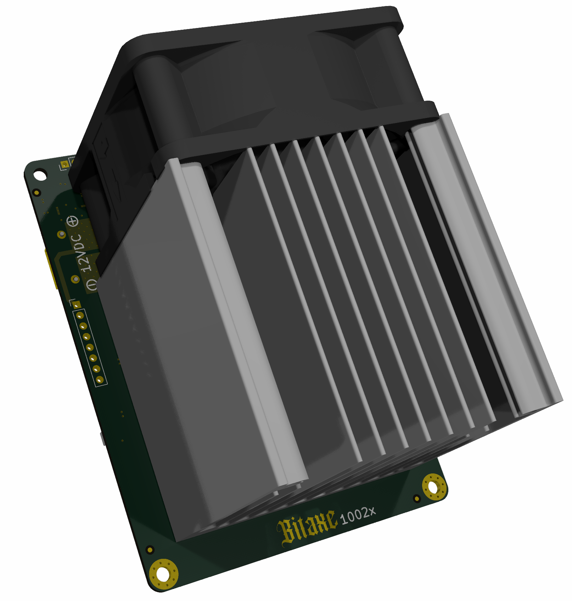

bitaxeBonanza quad Intel BZM2 ASIC miner.

It is still an untested prototype! Don't build this expecting it to work out of the box. Do build it if you want to hack on some rad stuff.

- [Open Hardware License](LICENSE); Real Open Source.
	- [KiCAD](https://kicad.org) design files. 
- Four Intel BZM2 ASICs, powered in series.
	- Each BZM2 is [nominally](doc/specs.md) 0.7V with approx 350 GH/s @ 1.15 GHz hash frequency.
	- On chip digital temperature and voltage sensors
	- ntime rolling
- 11-13V XT30 input voltage
- TPS546D24S single-phase voltage regulator tuned for 2.8V output @ 20A
	- The voltage regulator backside power plane is exposed to hopefully thermally bond it with the main heatsink. 
- New fan control strategy (no more EMC2101)
- ESP32S3 for [esp-miner](https://github.com/bitaxeorg/esp-miner) support.
- 9-bit serial ASIC support via RP2040
    - Preliminary support with the [bitaxe-raw-pico](https://github.com/bitaxeorg/bitaxe-raw/tree/pico) firmware.
- Gerbers _not_ provided to discourage side hacks and AliEx slop. HMU if you need help generating gerbers with KiCad.

©️ [bitaxeorg](https://bitaxe.org)